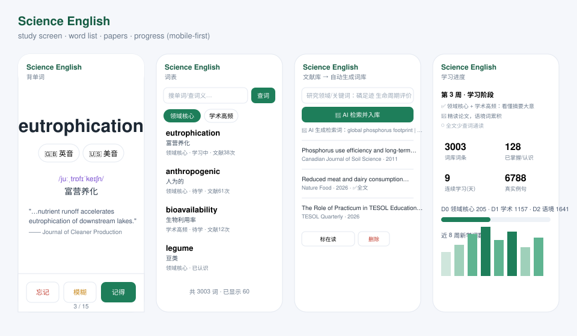

# Science English

[](https://github.com/cometrue171/paper-vocab-trainer/actions/workflows/ci.yml)
[](LICENSE)
[](pyproject.toml)
[](pyproject.toml)

**Turn your research papers into a personal vocabulary trainer.**

Science English reads academic papers in *your* field, mines the words you actually need,
and drills them with spaced repetition using **real sentences from those papers** — instead of
generic word lists.

Built for graduate students and researchers who must read English literature in a specific
domain (environmental science, agriculture, food systems, applied linguistics, …).

<details>
<summary>中文简介（点击展开）</summary>

把「你研究领域的英文文献」自动变成**带真实例句的词库**：抓取文献 → 分词分层 → 间隔复习背单词 +
文献句子翻译，逐步做到不查词典读文献。支持本地运行或自己的服务器部署、多账号数据隔离、
可选用任意 OpenAI 兼容 API 做“关键词 → 检索词”的智能抓取。

</details>

---

## Screenshots



## Features

- **Corpus → vocabulary** – pulls open-access literature metadata/abstracts from the
  [OpenAlex](https://openalex.org) API (no API key), optionally downloads OA full texts (PDF),
  and builds a word pool from what you actually read.
- **Domain-aware tiering** – words are tiered into **D0 domain core** (from a direction seed list),
  **D1 academic** (CET-6 / 考研 / TOEFL / IELTS / GRE bands), **D2 corpus-specific**;
  basics (high-school / CET-4 and below) are skipped automatically.
- **Target difficulty level** – per account: treat “CET-4 and below” / “CET-6 and below” /
  “postgraduate-entrance and below” as already known, so only harder words reach your queue.
- **Spaced repetition (SM-2)** – daily new words + due reviews, with a clean full-screen
  recitation UI (self-check “I know it”, undo previous card, pinned answer bar).
- **Real example sentences** – every card carries sentences taken from the paper the word came from,
  with the target word highlighted; sentence-translation practice on top (optional LLM reference
  translation).
- **Pronunciation** – IPA phonetic from a bundled offline dictionary, plus one-tap UK/US audio.
- **Offline English→Chinese dictionary** – [ECDICT](https://github.com/skywind3000/ECDICT) (~770k entries)
  imported into SQLite, plus an optional en-US IPA table.
- **Multi-account, admin-managed** – no public sign-up; an admin creates accounts in `/admin.html`.
  Each account has its own papers, word pool, contexts, progress and settings (hard isolation).
- **Web app + Android shell** – plain Flask + SQLite server, mobile-first UI, optional Capacitor
  Android wrapper (WebView shell) for a home-screen app.

## What a card looks like

```
┌──────────────────────────────────────┐
│  eutrophication            D0 · 磷领域 │
│  🇬🇧 英音    🇺🇸 美音                   │
│                                      │
│  /juːˌtrɒfɪˈkeɪʃn/  富营养化           │
│                                      │
│  "…nutrient runoff accelerates        │
│   eutrophication of downstream        │
│   lakes and coastal waters."          │
│   —— Journal of Cleaner Production    │
│                                      │
│  忘记        模糊        记得          │
└──────────────────────────────────────┘
```

Every word is shown with **IPA**, **one-tap UK/US audio**, a **Chinese gloss** and one or two
**sentences taken from the paper it came from** — so you rehearse the word in the exact context
you will meet it again.

## Where it fits

Reads-heavy research fields where the literature is English but the reader is not a native
speaker — environmental science / phosphorus & nutrient cycles, agriculture and food systems,
applied linguistics and language teaching, and any lab that maintains its own paper corpus.
It is deliberately **self-hostable, offline-first for the dictionary, and dependency-light**,
so a single lab or a single researcher can run it on a small VPS or a laptop.

## Install & run

Requirements: **Python 3.12+** and [uv](https://docs.astral.sh/uv/) (`curl -LsSf https://astral.sh/uv/install.sh | sh`).

### Option A — run locally (no server needed)

```bash
git clone https://github.com/cometrue171/paper-vocab-trainer
cd paper-vocab-trainer
uv run manage.py init          # create the SQLite DB + import the offline dictionary (~150 MB, once)
uv run manage.py serve         # http://127.0.0.1:5010
```

The first run prints a generated **admin password** (or set `SEED_ADMIN_PASSWORD` first).
Log in → `/admin.html` → create an account → pick its direction → start learning.
Your data never leaves the machine.

### Option B — deploy on your own server

Any small VPS works. The repo ships generic templates in `deploy/`:

```bash
# on the server
sudo useradd -m -s /bin/bash science || true
sudo -u science -H bash -c '
  cd ~ && git clone https://github.com/cometrue171/paper-vocab-trainer app && cd app
  uv sync && uv run manage.py init'

# systemd unit (edit User/WorkingDirectory if you changed them)
sudo cp deploy/science-english.service /etc/systemd/system/science-english.service
sudo systemctl daemon-reload && sudo systemctl enable --now science-english

# reverse proxy: copy the snippet into your nginx server block, then
sudo nginx -t && sudo systemctl reload nginx
```

`deploy/science-english.service` runs the app on `127.0.0.1:8013`; `deploy/nginx.conf`
proxies it under `/english/` and raises the upload limit for PDFs. The app keeps its own
session login, so put it behind HTTPS and you are done. Nothing in the templates points at
any specific host — fill in your own.

### Option C — Android app

`mobile/` is a small Capacitor shell. **It contains no server address**: on first launch it
asks for the URL of *your own* instance (`http://<lan-ip>:5010` or `https://your-domain/english/`)
and remembers it.

```bash
cd mobile
npm install
npx cap add android      # first time only
bash build.sh            # → android/app/build/outputs/apk/release/app-release.apk
```

Create your own keystore for release signing (see `mobile/README.md`); never commit it.

## Filling the pool

```bash
uv run manage.py fetch   --account <username> --limit 200   # OpenAlex metadata + abstracts
uv run manage.py oa      --account <username>               # optional: open-access full texts
uv run manage.py extract --account <username>               # tokenise → word pool + example sentences
uv run manage.py status  --account <username>
```

Fetch a specific journal by name or ISSN (useful for domain corpora):

```bash
uv run manage.py fetch --account <username> --source "Nature Food" --limit 150
```

### Smart harvesting with an LLM (optional)

Settings → **AI 检索**: paste any OpenAI-compatible `base URL` + `API key` (+ model). Then in
**文献库**, type your research field (e.g. *“phosphorus footprint, life-cycle assessment,
eutrophication”*) and press **🤖 AI 检索并入库**. The model turns it into 6–10 academic search
queries plus recommended journals, which are fetched, tokenised and added to your pool
automatically. Without a key, the button simply uses your keywords as-is — no other feature
depends on an API key.

### Difficulty target

Per account, pick how much counts as “already known”, so the queue surfaces only harder words:

| Level | Skipped (treated as known) | Learned |
|---|---|---|
| `zk` — entry | junior-high basics only | high-school, CET-4, CET-6, 考研, IELTS/TOEFL/GRE, academic |
| `cet4` — standard (default) | high-school … CET-4 | CET-6, 考研, IELTS/TOEFL/GRE, academic |
| `cet6` — raised | … CET-6 | 考研, IELTS/TOEFL/GRE, academic |
| `ky` — advanced | … 考研 | IELTS/TOEFL/GRE, academic |

Set it in Settings → 目标词汇难度, and re-screen an existing pool with
`manage.py level --account <user> --level zk|cet4|cet6|ky`.

## How it works

```
OpenAlex ──► papers(metadata/abstract, OA PDF) ──► tokenise & lemmatise
      └─► tier D0/D1/D2 (ECDICT exam bands + direction seed)
      └─► contexts: real sentences containing each word
words ──► SM-2 scheduler ──► daily new + due reviews ──► web UI / Android shell
```

| Layer | File(s) |
|---|---|
| Data / accounts / migrations | `lib/db.py` |
| Literature harvesting (OpenAlex) | `lib/corpus.py` |
| PDF text extraction | `lib/pdfparse.py` |
| Tokenising, tiering, sentence mining | `lib/tokenize.py`, `lib/sentences.py` |
| Offline dictionary & level bands | `lib/gloss.py` |
| Spaced repetition / schedule | `lib/srs.py`, `lib/schedule.py` |
| Direction seeds & default keywords | `lib/directions.py`, `data/seed_*.tsv` |
| Web app (session auth, admin API) | `app.py`, `static/` |
| CLI | `manage.py` |

## Directions (domains)

Each account has a *direction* that selects (a) the domain seed word list and (b) the default
harvest keywords. Ships with two examples — phosphorus/environment and English-language-teaching —
and you can add your own by dropping a `data/seed_<domain>.tsv` (`word<TAB>中文释义`) and extending
`lib/directions.py`.

## Roadmap

- [ ] Web UI to import a paper by DOI (today: `manage.py` or the admin API)
- [ ] Optional PDF text layers for paywalled papers uploaded by the user
- [ ] Seed lists for more domains (contributions welcome — see `data/seed_*.tsv`)
- [ ] Export/import the word pool (Anki-compatible)

## License

MIT — see [LICENSE](LICENSE). Third-party data: ECDICT (dictionary) and OpenAlex (metadata) keep
their own terms; downloaded corpora are not part of this repository.

## Contributing

Issues and PRs are welcome. Please keep the code dependency-light (Flask + SQLite + pypdf) and
make sure `uv run manage.py init --no-dict && uv run manage.py serve` still works.
